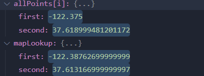
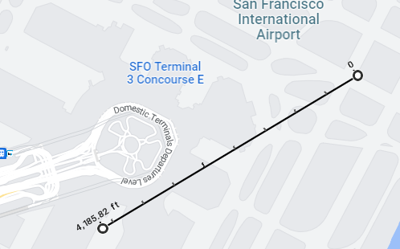

Shiv Gohil, Binh Minh Nguyen, Nuoyan Wang, Andrew Zhao 
Carl Evans, Brad Solomon, Thierry Ramais 
CS 225 
12 December 2022 
# CS225 Final Project Report  
## Introduction  
Throughout the process of this project, we aimed to answer the fundamental question: Using a dataset of road intersections and edges and a dataset of airport locations, how can we best implement a “Shortest-Route Finder” using a graph data structure and algorithms? Ultimately, we represented intersections and airports as nodes in our graph, with road connections and air flights as the edges. Moreover, having decided on using California as our map area, we needed to complete the following stages: data cleaning and parsing, a graph implementation, as well as graph algorithms (BFS, Kruskal’s and A-star). 
## Data Cleaning: (getCleanedData.cpp)
First, we need to retrieve the data from our online datasets, and convert its format in the following way, keeping the pertinent information for our routeFinder application: 

>Nodes: (NodeID, transportType[0=road, 1=flight], name, longitude, latitude) 
>Edges: (EdgeID, transportType[0=road, 1=flight], startID, endID, direct-distance)

In this manner, we can later create weighted edges, where the weight is determined by distance multiplied by different factors for air and ground travel. Here, distance is the euclidean distance between two points, measured in units of “degrees of longitude-latitude.” We later omit the curvature of the Earth when converting from these degrees into units of miles or km as the distances between California are small enough that the curvature is small.  

Having decided on this format, we begin data cleaning within the “getCleanedData.cpp” file. Our function takes input filenames for the 3 datasets containing the California intersections, California road edges, and the World airports. For each of these three datasets, we iterate through the .dat file line by line, separating each line into vectors of strings depending on the comma-separated or space-separated nature of the original data file. As we iterate through, we need to omit erroneous data, such as duplicating edges, self-looping edges, as well as all non-commercial and non-California airports. The data we want within each individual line-by-line vector is then selected and output into output nodes.txt and edges.txt files, according to the formats in bold above.  

Now, our output nodes.txt file contains the road intersection and airport nodes, while our edges.txt file contains the road edges between select intersections. We still need to create flight edges between airports. To do this, we make the assumption that each of our selected airports has a flight to-and-from every other airport. We want to append these flights as edges in our output edges.txt files. To accomplish this, we need to add a portion of code within the airport data cleaning, allowing us to store a vector of just the airport nodes we want. Then, we simply use a nested for loop to create edges between every pair of airports, which are then appended to our edges.txt file as strings on each line. 

>Input and Output Text format visualized: 

### KDTree:
In the final step of data cleaning, we want to append new road edges from each airport to the nearest intersection. In doing so, we complete our integration between the road network and the airport network, which allows us to seamlessly transition from driving to getting to an airport and taking a flight and vice versa. The best method that we figured out how to  accomplish our goals was by using the Kd-Tree that we created before in the “mp_mosiacs” assignment as we had already completed the findNearestNeighbor() function in said assignment.  

In our project, we made the entire process of finding and then creating these edges a separate function called connectGraphs() which takes in the index of the last edge created as an integer variable called currIdx and returns a vector of strings. This section of the code simply creates a vector of Points using the longitude and latitude of every intersection node and maps that Point to its node ID. We then call the Kd-tree constructor on that vector and loop through every single airport node; we can then use the longitude and latitude of the airport nodes to call findNearestNeighbor() and feed the result into our map. This returns us the ID of the closest intersection to said airport which can then be used to create an edge between the intersection and current airport with, ID = currIdx+1 type= 0 and weight=0 . The reason our weight is 0 is because the exact length is unknown, but should be small enough that is negligible and thus can be represented as a 0. This edge is then inserted into a vector of strings and currIdx is incremented for the next edge. When the loop completes, it simply returns the vector of all the edges to be used by the rest of the code which appends it to edges.txt.  

This current method is rather accurate, an example is shown below to prove this where allPoints is the airport location and mapLookup is the closest intersection:

>Airport to Closest Intersection Coordinates on Google Maps 

